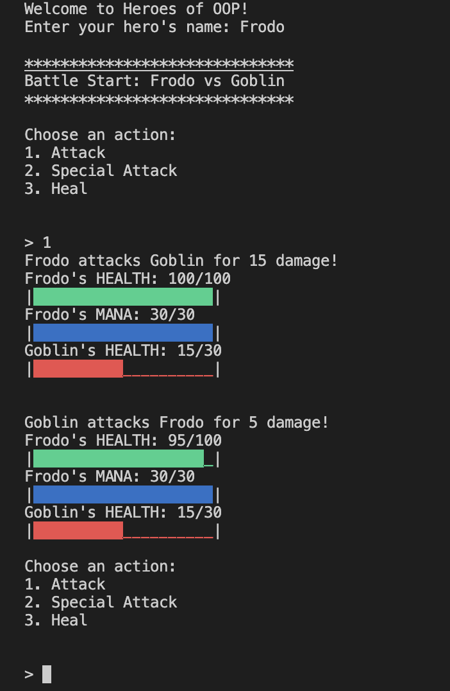

Heroes of OOP
===========================
This is a text-based role-playing game (RPG) designed to teach players about object-oriented programming (OOP) concepts by creating and managing classes. Players create heroes and battle monsters by correctly implementing and modifying classes in Python.

Reference: Ork Slayer Gamedev on YouTube / ChatGPT

 

